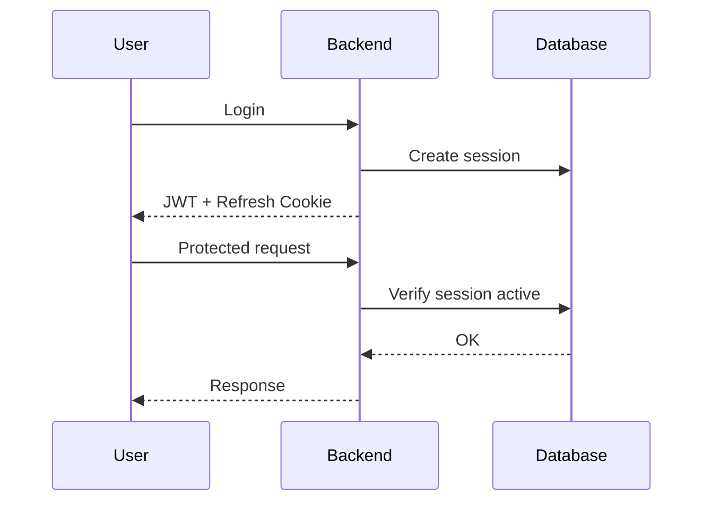
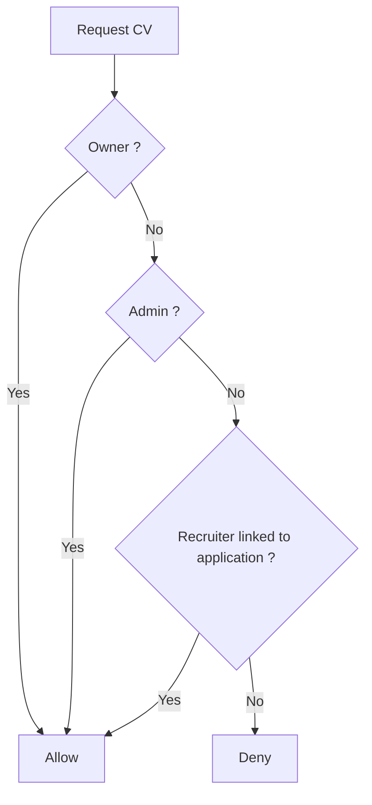
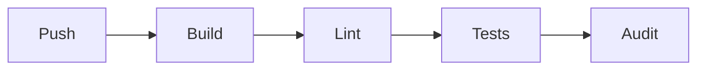

# Cybersécurité — Starz.work

## 1. Vue d’ensemble

Starz.work est une plateforme d’agrégation d’offres d’emploi construite avec :

- Backend : Node.js + Express + TypeScript
- Frontend : Next.js + React
- IA : FastAPI + spaCy
- Base de données : MySQL 8.4
- Infrastructure : Docker + GitHub 

La plateforme gère des données sensibles :
- comptes utilisateurs ;
- sessions authentifiées ;
- CVs ;
- candidatures ;
- données issues d’APIs externes.

L’objectif principal était donc de sécuriser :
- l’authentification ;
- les uploads ;
- les accès administrateurs ;
- l’ingestion de données externes ;
- les communications entre services.

---

# 2. Architecture sécurité

```mermaid
flowchart LR
    Client --> Frontend
    Frontend --> Backend
    Backend --> MySQL
    Backend --> AIService
    Backend --> WLD[WeLoveDevs API]
````

Le backend suit une architecture :

```text
Routes → Controller → Service → Schema
```

Cette séparation permet :

* une validation centralisée ;
* une logique métier isolée ;
* un meilleur contrôle des accès.

**Preuve code :**
`starz-backend/architecture/01-routes-controller-service-schema.md`

---

# 3. Authentification et sessions

## Choix : JWT court + refresh token + sessions DB

### Why

Un JWT purement stateless ne permet pas de révoquer immédiatement une session compromise.
Le projet ayant un système de bannissement et de révocation de session, il fallait pouvoir invalider un accès côté serveur.

### How

* Access token JWT : durée de vie courte (15 min)
* Refresh token : stocké en cookie `httpOnly`
* Session persistée en base
* Vérification de session à chaque requête protégée



### Trade-off

| Avantages                          | Inconvénients                     |
| ---------------------------------- | --------------------------------- |
| Révocation immédiate               | Requête DB à chaque appel protégé |
| Isolation par appareil             | Plus complexe qu’un JWT simple    |
| Protection XSS via cookie httpOnly |                                   |

### Alternative rejetée

JWT totalement stateless.

Rejeté car impossible de révoquer immédiatement un token volé.

### Preuve

`starz-backend/src/middlewares/auth.middleware.ts`

```ts
if (session.is_revoked === 1) return false;
if (session.banned_at !== null) return false;
```

---

# 4. Validation des entrées

## Choix : validation Zod

### Why

Toutes les entrées utilisateur ou externes sont considérées comme non fiables.

La validation permet de limiter :

* injections SQL ;
* données invalides ;
* mass assignment ;
* erreurs runtime.

### How

Les middlewares utilisent `schema.safeParse()` avant d’atteindre les controllers.

Exemples :

* email valide ;
* mot de passe min/max ;
* enums OAuth ;
* cohérence salaire min/max.

### Trade-off

| Avantages                     | Inconvénients            |
| ----------------------------- | ------------------------ |
| Validation centralisée        | Plus de code à maintenir |
| Typage TypeScript automatique |                          |
| Réduction des injections      |                          |

### Preuve

`starz-backend/src/middlewares/validate.middleware.ts`

---

# 5. Sécurité des uploads

## Choix : validation par magic bytes

### Why

Un attaquant peut renommer un fichier malveillant en `.pdf` ou `.jpg`.
Valider uniquement l’extension ou le `Content-Type` est insuffisant.

### How

Les premiers octets du fichier sont analysés :

| Format | Signature     |
| ------ | ------------- |
| PDF    | `%PDF-`       |
| PNG    | `89 50 4E 47` |
| JPEG   | `FF D8 FF`    |

Les noms de fichiers sont également sanitisés pour éviter le path traversal.

### Trade-off

| Avantages                          | Inconvénients           |
| ---------------------------------- | ----------------------- |
| Détection des faux fichiers        | Pas d’antivirus intégré |
| Réduction des uploads malveillants |                         |

### Preuve

`starz-backend/src/helpers/upload.ts`

```ts
throw createHttpError(400, "Uploaded file content does not match its type");
```

---

# 6. Contrôle d’accès aux CVs

## Why

Les CVs contiennent des données personnelles sensibles.
Un recruteur ne doit pouvoir accéder qu’aux CVs des candidats ayant postulé à ses offres.

### How

Le middleware vérifie :

* propriétaire du fichier ;
* administrateur ;
* ou recruteur lié à une candidature.



### Trade-off

| Avantages              | Inconvénients             |
| ---------------------- | ------------------------- |
| Privacy by design      | Requête DB supplémentaire |
| Contrôle fin des accès |                           |

### Preuve

`starz-backend/src/middlewares/privateUpload.middleware.ts`

```sql
SELECT a.id FROM applications a
INNER JOIN offers o ON o.id = a.offer_id
WHERE a.user_id = ?
```

---

# 7. Rate limiting

## Why

Les routes d’authentification sont exposées aux attaques brute-force.

### How

Implémentation custom basée sur une sliding window in-memory.

* limitation par IP ;
* headers RFC standards ;
* réponse HTTP 429.

### Trade-off

| Avantages           | Inconvénients       |
| ------------------- | ------------------- |
| Pas besoin de Redis | Non distribué       |
| Faible latence      | Scalabilité limitée |

### Alternative rejetée

Redis + express-rate-limit.

Rejeté pour éviter une dépendance supplémentaire 

### Preuve

`starz-backend/src/middlewares/rateLimit.middleware.ts`

```ts
res.status(429).json({ success: false, message: "Too many requests" });
```

---

# 8. Sécurité infrastructure

## Headers HTTP

Le backend utilise `helmet()` pour activer automatiquement :

* HSTS ;
* protection clickjacking ;
* `X-Content-Type-Options` ;
* désactivation de `x-powered-by`.

## CORS

En production, seules les origines whitelistées peuvent envoyer des requêtes authentifiées.

```ts
https://starz.work
https://api.starz.work
```

## Protection des secrets

Le serveur refuse de démarrer en production avec :

* un JWT faible ;
* un mot de passe DB par défaut.

### Preuve

`starz-backend/src/config/env.ts`

```ts
throw new Error("JWT_SECRET must be configured with a strong value")
```

---

# 9. Base de données

## Choix : MySQL relationnel

### Why

Le projet contient de nombreuses relations :

```text
users → sessions → refresh_tokens
users → applications → offers → companies
```

Les transactions ACID étaient nécessaires.

### How

* clés étrangères ;
* transactions ;
* contraintes CHECK ;
* index de sécurité.

Les tokens sensibles ne sont jamais stockés en clair.

### Trade-off

| Avantages            | Inconvénients                         |
| -------------------- | ------------------------------------- |
| Intégrité forte      | Scalabilité horizontale plus complexe |
| Transactions fiables |                                       |

### Alternative rejetée

MongoDB.

Rejeté car les relations métier étaient fortement relationnelles.

### Preuve

`refresh_tokens.token_hash CHAR(64)`

`users.password_hash VARCHAR(255)`

---

# 10. Sécurité du service IA

## Choix : spaCy local

### Why

Les CVs contiennent des données personnelles sensibles.

Envoyer ces données vers un LLM externe aurait posé :

* des problèmes RGPD ;
* des coûts ;
* une dépendance externe.

### How

Le service IA fonctionne localement avec :

* FastAPI ;
* spaCy ;
* extraction de mots-clés ;
* matching CV/offre.

Le service est isolé dans son propre conteneur.

### Trade-off

| Avantages                  | Inconvénients                |
| -------------------------- | ---------------------------- |
| Données gardées localement | IA moins puissante qu’un LLM |
| Temps de réponse rapide    |                              |
| Coût nul à l’usage         |                              |

### Alternative rejetée

GPT-4 / Claude Code

Rejeté pour des raisons de confidentialité et de coût.

---

# 11. CI/CD et sécurité

Le pipeline GitHub Actions exécute automatiquement :

* build TypeScript ;
* lint ;
* tests backend ;
* tests DB ;
* audit des dépendances.



### Preuve

`.github/workflows/ci.yml`

```yml
- name: Audit
  run: npm run audit
```

Le projet bloque donc les dépendances contenant des vulnérabilités modérées ou critiques.

---

# 12. Risques résiduels

Même avec ces protections, certaines limites restent présentes :

| Risque                                           | Impact                                             |
| ------------------------------------------------ | -------------------------------------------------- |
| Rate limiter non distribué                       | Scalabilité limitée                                |
| Service IA avec CORS `*`                         | Acceptable seulement en réseau privé               |
| Pas d’antivirus upload                           | Fichiers malveillants possibles dans un PDF valide |
| Uploads stockés localement                       | Risque de perte sans backup                        |
| Pas de cleanup automatique des sessions expirées | Croissance DB long terme                           |

---

# 13. Conclusion

La stratégie cybersécurité de Starz.work repose sur plusieurs couches complémentaires :

* validation des entrées ;
* authentification sécurisée ;
* contrôle d’accès ;
* protection des uploads ;
* isolation Docker ;
* sécurisation CI/CD.

Le projet privilégie des solutions simples mais robustes, adaptées à une architecture fullstack moderne et aux contraintes d’un projet réaliste.

Les décisions prises cherchent principalement à équilibrer :

* sécurité ;
* performances ;
* maintenabilité ;
* simplicité d’exploitation.

```
```
