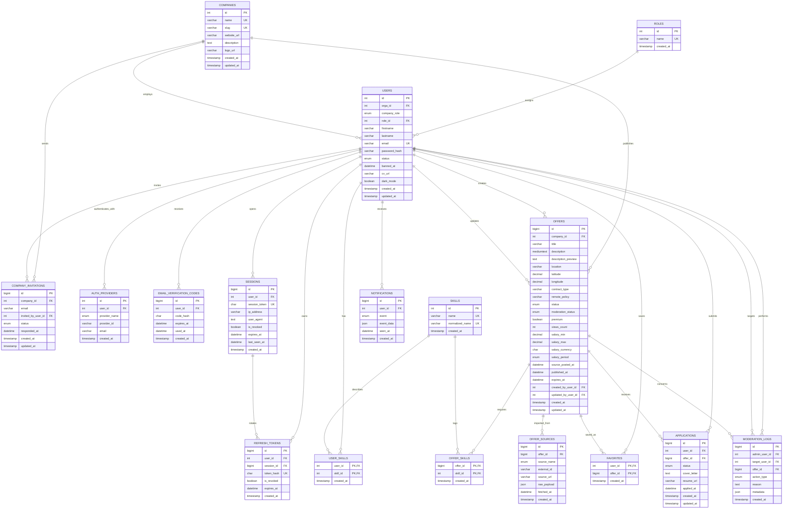

# Schéma de base de données

Ce document décrit le modèle relationnel MySQL défini dans `database/init.sql`. Le schéma couvre les comptes, les rôles, les entreprises, les offres, l'ingestion WeLoveDevs, les candidatures, les notifications et la modération.

## Vue ERD

## Zones fonctionnelles

### Identité et accès

Les tables `roles`, `users`, `auth_providers`, `sessions`, `refresh_tokens` et `email_verification_codes` structurent l'authentification.

- `roles` contient les rôles applicatifs minimum: `user` et `admin`.
- `users.role_id` impose le rôle via une clé étrangère.
- `sessions` permet de révoquer une session côté serveur.
- `refresh_tokens` stocke des jetons hachés et rattachés à une session.
- `auth_providers` permet de lier un compte local, Google, GitHub ou LinkedIn.

### Entreprises et recruteurs

Les recruteurs sont représentés par des utilisateurs liés à une entreprise via `users.orga_id`. Le champ `users.company_role` distingue les membres et les owners.

`company_invitations` garde les invitations envoyées par un utilisateur recruteur vers une adresse email, avec un statut `pending`, `accepted`, `declined` ou `cancelled`.

### Offres et ingestion externe

`offers` est la table centrale des annonces. Elle stocke les champs affichés dans le produit: titre, description, localisation, contrat, télétravail, salaire, statut de publication et statut de modération.

`offer_sources` trace l'origine de l'offre. Pour WeLoveDevs, la contrainte unique `(source_name, external_id)` rend la synchronisation idempotente et évite les doublons. Le champ `raw_payload` conserve la donnée brute pour audit, debug et retraitement.

### Compétences, favoris et candidatures

Les compétences sont normalisées dans `skills`, puis reliées aux offres par `offer_skills` et aux profils par `user_skills`.

`favorites` est une table de jointure entre utilisateurs et offres sauvegardées.

`applications` relie un candidat à une offre avec un statut métier: `submitted`, `viewed`, `accepted`, `rejected` ou `withdrawn`. La contrainte unique `(user_id, offer_id)` empêche plusieurs candidatures actives sur la même offre.

### Notifications et modération

`notifications` stocke les événements visibles côté utilisateur, comme les invitations entreprise ou les mises à jour de candidature.

`moderation_logs` conserve les actions administrateur: bannissement, débanissement, rejet d'offre, archivage ou restauration. Les liens optionnels vers `target_user_id` et `offer_id` permettent d'auditer les décisions sans perdre l'historique quand une cible est supprimée.

## Contraintes d'intégrité importantes

- `users.email` est unique.
- `roles.name`, `companies.name`, `companies.slug`, `skills.name` et `skills.normalized_name` sont uniques.
- `offer_sources` impose l'unicité `(source_name, external_id)` pour éviter les doublons d'ingestion.
- `applications` impose l'unicité `(user_id, offer_id)` pour éviter les candidatures dupliquées.
- `offers` contient une contrainte `CHECK` garantissant que `salary_min <= salary_max` quand les deux valeurs existent.
- Les suppressions en cascade sont utilisées pour les données dépendantes directes comme sessions, refresh tokens, skills d'offre, favoris, candidatures et notifications.
