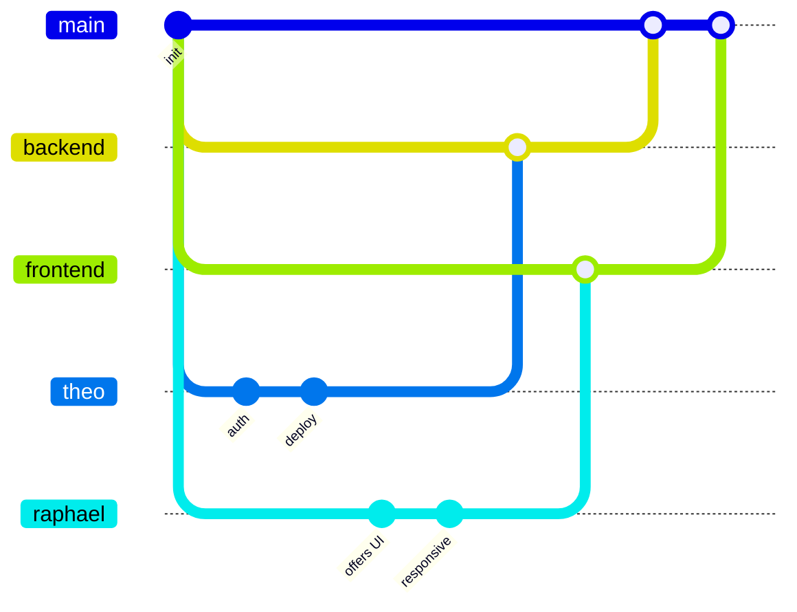

# 12 — Preuve de gestion de projet

## Vue d’ensemble

Le projet a été réalisé par une équipe de 4 étudiants avec une organisation fullstack répartie entre frontend, backend, infrastructure et sécurité.

L’objectif du projet était de développer une plateforme de recrutement et d’agrégation d’offres tech avec :
- authentification OAuth,
- recherche et consultation d’offres,
- dashboard utilisateur,
- dashboard administrateur,
- infrastructure Dockerisée,
- pipeline CI/CD.

Le développement a été réalisé de manière collaborative avec :
- GitHub,
- Pull Requests,
- branches dédiées,
- documentation Notion,
- synchronisation régulière entre frontend et backend.

---

# Organisation de l’équipe

| Membre | Responsabilités principales |
|---|---|
| Theo | Backend, architecture API, CI/CD, déploiement |
| Raphael | Frontend, intégration UI/UX, responsive |
| Jules | Liaison frontend/backend, audit sécurité, OAuth |
| Simon | Docker, infrastructure, IA, support frontend |

---

# Méthodologie de travail

## Outils utilisés

Le suivi du projet a été réalisé avec :
- GitHub
- Notion
- Docker
- GitHub Pull Requests

La documentation technique et l’organisation des tâches étaient centralisées sur Notion :
- architecture frontend,
- architecture backend,
- répartition des responsabilités,
- suivi des fonctionnalités,
- documentation technique.

---

# Workflow Git

## Structure des branches

Le projet utilisait plusieurs branches afin de séparer les développements :

- `main` → branche de production
- `frontend` → intégration frontend
- `backend` → intégration backend
- branches personnelles :
  - `theo`
  - `raphael`
  - autres branches de travail spécifiques

Chaque fonctionnalité était développée sur une branche dédiée avant d’être fusionnée via Pull Request.

---

# Stratégie de merge

---

# Convention de commits

Le projet utilisait une convention de nommage claire pour les commits :

| Préfixe | Utilisation |
|---|---|
| `feat:` | ajout de fonctionnalité |
| `fix:` | correction de bug |
| `docs:` | documentation |
| `deploy:` | déploiement |
| `ci:` | CI/CD |

---

# Exemples de commits réels

## Frontend

- `feat(frontend): responsive mobile — navbar hamburger, layout fluid, filtres drawer`
- `feat(frontend): rework admin responsive`
- `feat(frontend): responsive last fixes and accessibility`
- `feat(login): fix responsive`

## Déploiement / Infrastructure

- `feat(deploy): Prepare prod deployment`
- `fix(deploy): Fix deployment (add stop condition)`
- `Fix backend production Docker dependencies`

## Sécurité / Authentification

- `fix oauth github (unify)`
- `fix(docs cyber audit): fixing the .md`

## CI/CD

- `feat(ci/frontend): add CD deployment`

---

# Preuve de collaboration

Le dépôt GitHub montre une activité collaborative continue via Pull Requests.

Exemples de merges :
- `Merge pull request #85 from frontend`
- `Merge pull request #84 from raphael`
- `Merge pull request #81 from theo`
- `Merge pull request #79 from raphael`
- `Merge pull request #73 from theo`

Cette organisation permettait :
- la séparation des responsabilités,
- la validation du code avant intégration,
- la réduction des conflits,
- une intégration progressive des fonctionnalités.

---

# Chronologie du projet

| Phase | Objectif |
|---|---|
| Phase 1 | Recherche produit et définition de l’architecture |
| Phase 2 | Développement backend et API |
| Phase 3 | Développement frontend |
| Phase 4 | Intégration OAuth |
| Phase 5 | Dashboard utilisateur et admin |
| Phase 6 | Dockerisation et CI/CD |
| Phase 7 | Audit sécurité et corrections |
| Phase 8 | Responsive et accessibilité |

---

# Synchronisation frontend / backend

Le frontend et le backend ont été développés en parallèle.

Une synchronisation régulière était nécessaire pour :
- les routes API,
- l’authentification,
- les dashboards,
- les filtres d’offres,
- la gestion administrateur.

Exemples de commits liés à l’intégration :
- `Merge branch 'theo' into frontend`
- `fix oauth github (unify)`

---

# Gestion de l’infrastructure

L’infrastructure du projet reposait sur Docker afin d’assurer :
- un environnement de développement uniforme,
- un déploiement simplifié,
- une séparation claire des services.

Services utilisés :
- frontend Next.js,
- backend Express.js,
- MySQL,
- phpMyAdmin.

---

# CI/CD

Le projet intégrait une logique CI/CD afin de :
- automatiser les builds,
- préparer le déploiement production,
- stabiliser les déploiements,
- réduire les erreurs manuelles.

Exemples :
- `feat(ci/frontend): add CD deployment`
- `fix(deploy): Fix deployment (add stop condition)`

---

# Gestion de la sécurité

La sécurité du projet était suivie principalement par Jules.

Les points traités incluaient :
- l’authentification OAuth,
- la sécurisation des échanges frontend/backend,
- les corrections liées à GitHub OAuth,
- l’audit sécurité du projet.

Un audit sécurité documenté a également été réalisé.

---

# Problèmes rencontrés et solutions

| Problème | Solution apportée |
|---|---|
| Incohérences OAuth GitHub | Uniformisation du flux OAuth |
| Bugs responsive mobile | Refonte responsive globale |
| Conflits Docker en production | Correction des dépendances backend |
| Synchronisation frontend/backend | Workflow Git avec branches dédiées |
| Instabilité du déploiement | Ajout de conditions de sécurité au déploiement |
| Responsive admin panel | Refonte responsive du dashboard admin |

---

# Amélioration continue

Le projet a évolué de manière itérative avec :
- des correctifs responsive,
- des améliorations accessibilité,
- des optimisations UI,
- des corrections de sécurité,
- des améliorations CI/CD.

Les derniers commits montrent principalement :
- des fixes responsive,
- des améliorations accessibilité,
- des stabilisations de déploiement,
- des optimisations frontend.

---

# Conclusion

Le projet a été développé avec une organisation collaborative reposant sur :
- GitHub,
- Pull Requests,
- branches dédiées,
- documentation centralisée,
- Docker,
- CI/CD.

L’historique Git démontre :
- une collaboration active,
- une intégration continue,
- une répartition claire des responsabilités,
- un suivi technique régulier,
- une évolution progressive du produit jusqu’à sa stabilisation.