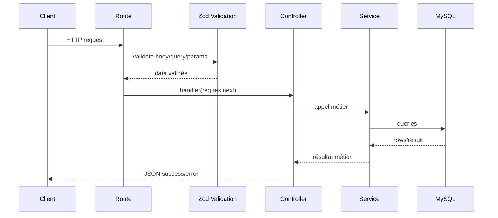

# Routes / Controller / Service / Schema

## Roles

- `auth.routes.ts`: déclare les endpoints et attache middlewares + validation
- `auth.schemas.ts`: définit les schémas Zod des entrées
- `auth.controller.ts`: lit la requête validée, appelle le service, construit la réponse HTTP
- `auth.service.ts`: logique métier + accès base + sécurité + intégrations

## Convention de réponse

- succès:
  - `success: true`
  - `message`
  - `data` si nécessaire
- erreur:
  - `success: false`
  - `message`
  - `errors` pour validation
