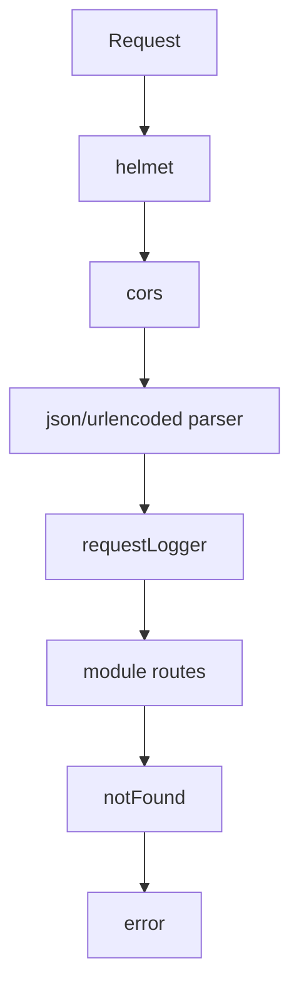
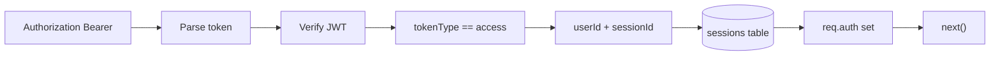

# Middlewares

## Middlewares actifs

- `requestLogger.middleware.ts`: log HTTP via Morgan
- `validate.middleware.ts`: validation Zod de `body/query/params`
- `auth.middleware.ts`: vérifie JWT access + session active en base
- `notFound.middleware.ts`: réponse 404 standardisée
- `error.middleware.ts`: réponse d'erreur centralisée

## Détail auth middleware

- une requête protégée n'est acceptée que si la session n'est pas révoquée et non expirée
