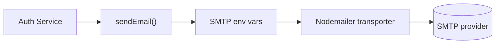

# Mailer

## Rôle

Le helper `src/helpers/mailer.ts` envoie les emails via SMTP (Nodemailer).

- lit la config SMTP depuis l'environnement
- crée un transport SMTP
- envoie `from/to/subject/text`
- retourne `false` si SMTP non configuré

## Variables attendues

- `SMTP_HOST`
- `SMTP_PORT`
- `SMTP_SECURE`
- `SMTP_USER`
- `SMTP_PASS`
- `SMTP_FROM`

## Usage actuel

- envoi du code de vérification email après `register`
- envoi du code lors de `resend-verification`
