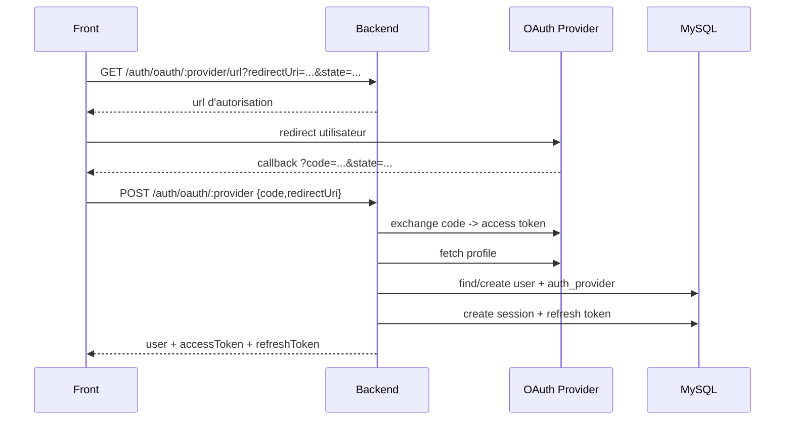
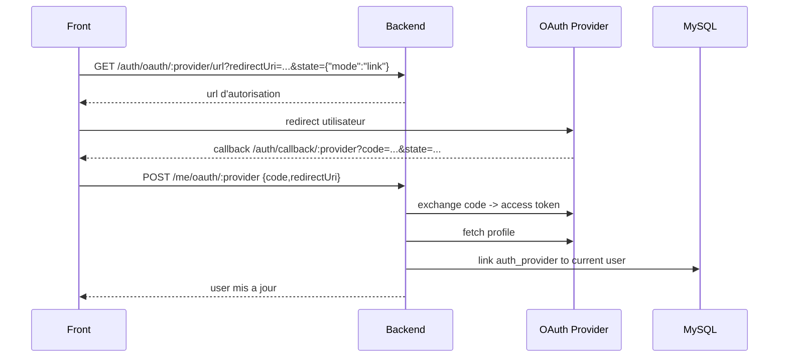

# OAuth

## Endpoints

- `GET /auth/oauth/:provider/url`
- `POST /auth/oauth/:provider`
- `POST /me/oauth/:provider`

`provider` accepté:

- `google`
- `github`
- `linkedin`

## Flow global

## Redirect URI et `state`

- Le backend valide strictement `redirectUri` contre `OAUTH_ALLOWED_REDIRECT_URIS`.
- En front, le callback standard est `https://starz.work/auth/callback/:provider`.
- Le même callback peut servir pour plusieurs intentions OAuth.
- `state` transporte le contexte front, par exemple `provider`, `mode` (`login` ou `link`) et `redirectTo`.
- Cette approche est utile pour GitHub, qui n'autorise qu'une seule callback URL par OAuth App.

## Flow de liaison d'un provider

## Rôle du helper oauth

`src/helpers/oauth.ts` gère:

- construction des URL d'autorisation
- échange `code` -> `access_token`
- récupération profil provider
- normalisation profil (`providerId`, `email`, `firstName`, `lastName`)

## Variables d'environnement OAuth

- `GOOGLE_CLIENT_ID`
- `GOOGLE_CLIENT_SECRET`
- `GITHUB_CLIENT_ID`
- `GITHUB_CLIENT_SECRET`
- `LINKEDIN_CLIENT_ID`
- `LINKEDIN_CLIENT_SECRET`
- `OAUTH_ALLOWED_REDIRECT_URIS`
