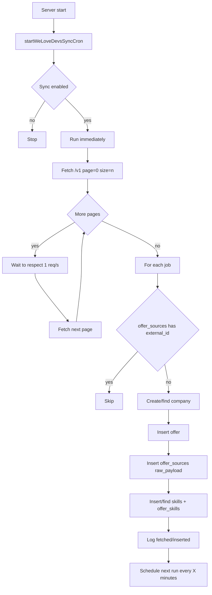

# WeLoveDevs Sync

## Objectif

Importer automatiquement des offres depuis l'API WeLoveDevs pour alimenter la base, sans écraser les données déjà importées et potentiellement modifiées via le site.

## Configuration

- `WLD_SYNC_ENABLED`
- `WLD_API_URL`
- `WLD_API_KEY`
- `WLD_SYNC_INTERVAL_MINUTES`
- `WLD_SYNC_PAGE_SIZE`
- `WLD_SYNC_QUERY`

## Flow global

## Règles métier importantes

- source importée marquée dans `offer_sources` avec `source_name = welovedevs`
- idempotence par `external_id` (pas de double import)
- comportement insert-only: pas de mise à jour des offres déjà importées
- limitation API respectée: maximum 1 requête/seconde
