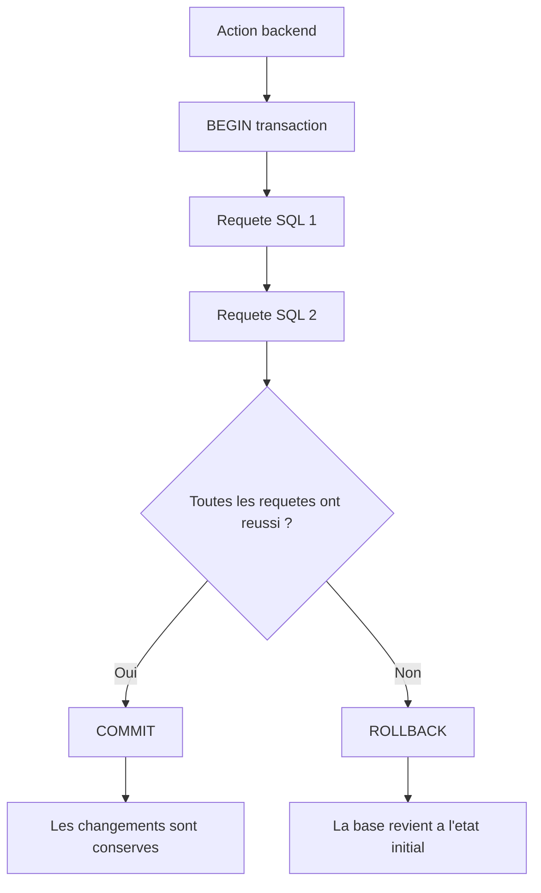
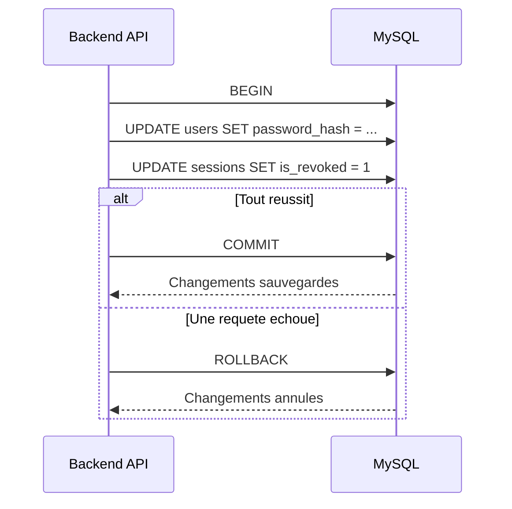

# Transactions SQL

Une transaction permet de regrouper plusieurs requetes SQL dans une seule operation logique.

L'objectif est simple : soit toutes les requetes reussissent, soit aucune modification n'est conservee.

## Principe



## Pourquoi c'est utile

Sans transaction, une action peut modifier partiellement la base.

Exemple : changement de mot de passe.

1. Mettre a jour le hash du mot de passe.
2. Revoquer les sessions existantes.

Si la premiere requete reussit mais que la seconde echoue, l'utilisateur a un nouveau mot de passe mais ses anciennes sessions restent actives. La transaction evite cet etat incoherent.

## Exemple de sequence



## Dans le code

Le helper `withTransaction` centralise ce comportement :

```ts
await withTransaction(async (connection) => {
	await connection.query("UPDATE users SET password_hash = ? WHERE id = ?", [
		passwordHash,
		userId
	]);

	await connection.query("UPDATE sessions SET is_revoked = 1 WHERE user_id = ?", [
		userId
	]);
});
```

Si une requete lance une erreur, `withTransaction` fait automatiquement un `rollback`.
Si tout se passe bien, il fait un `commit`.

## Quand utiliser une transaction

Utilise une transaction quand une action :

- modifie plusieurs tables ;
- fait plusieurs modifications qui doivent rester synchronisees ;
- cree une entite puis cree ses relations ;
- supprime un compte et ses donnees liees ;
- change une information sensible puis invalide des sessions.

Pas besoin de transaction pour une simple lecture, ni pour une modification unique sans effet lie.
