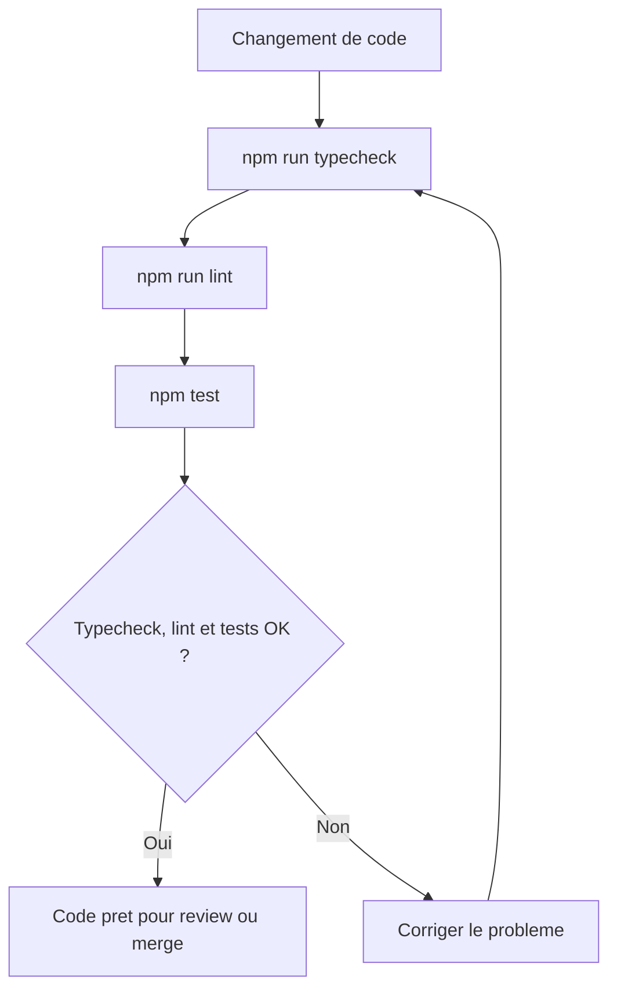
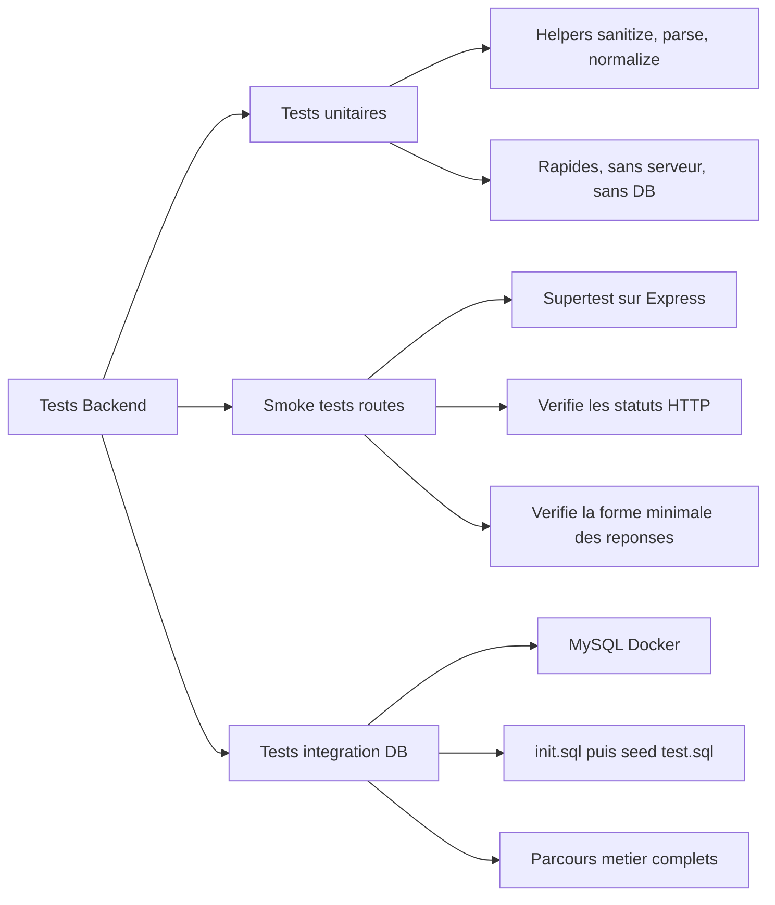
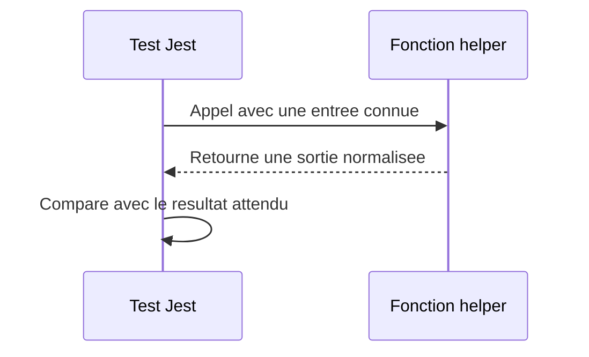
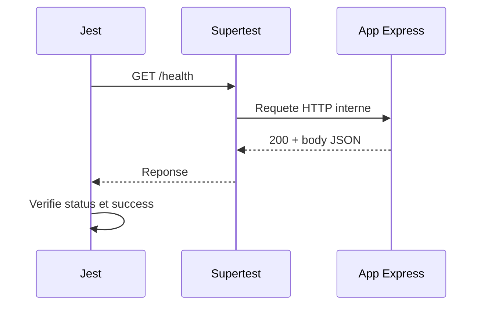
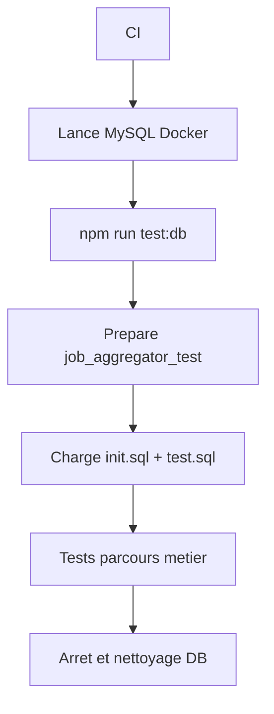

# Tests Backend

Les tests servent a verifier rapidement que le backend reste utilisable quand le code evolue.

L'objectif actuel est simple :

- tester les helpers critiques avec des tests unitaires ;
- verifier que les routes repondent avec des smoke tests ;
- preparer des tests d'integration plus complets avec une base MySQL Docker.

## Vue D'ensemble



## Types De Tests



## Tests Unitaires

Les tests unitaires testent une fonction isolee.

Exemples actuels :

- `normalizeEmail`
- `sanitizeOptionalText`
- `parsePositiveInteger`
- `booleanLikeSchema`
- helpers de dates
- helpers d'upload
- normalisation WeLoveDevs

Ils ne demarrent pas l'API et ne touchent pas la base.



## Smoke Tests De Routes

Les smoke tests verifient que les routes principales repondent.

Ils ne remplacent pas les vrais tests metier. Leur role est de detecter vite :

- une route cassee ;
- un middleware qui bloque mal ;
- une erreur serveur inattendue ;
- un changement de status HTTP non voulu.



## Integration Avec Base De Test

Pour tester les vrais parcours metier, on utilise une base MySQL dediee aux tests.

Le principe :

1. lancer MySQL avec Docker ;
2. executer `npm run test:db` ;
3. le script prepare `job_aggregator_test` ;
4. il charge `database/init.sql` puis `database/seeds/test.sql` ;
5. Jest lance les tests dans `tests/integration-db`.



## Parcours DB Actuel

Le premier parcours DB verifie :

- login utilisateur ;
- login recruteur ;
- acces a `/me` avec un token ;
- lecture des offres publiques ;
- candidature utilisateur a une offre ;
- consultation de la candidature cote entreprise ;
- passage automatique en `viewed` quand le recruteur ouvre la candidature ;
- acceptation de la candidature ;
- creation d'une notification utilisateur.

## Commandes

```bash
npm run typecheck
npm run lint
npm run test:unit
npm run test:smoke
npm test
npm run test:db
npm run audit
```
