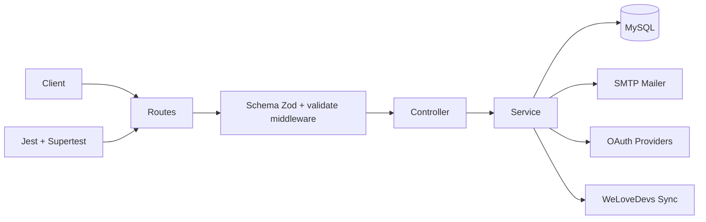

# Architecture Backend

Ce dossier documente l'architecture actuelle autour de:

- routes/controller/service/schema
- middlewares
- mailer
- OAuth
- sync WeLoveDevs
- tests

- [01-routes-controller-service-schema.md](./01-routes-controller-service-schema.md)
- [02-middlewares.md](./02-middlewares.md)
- [03-mailer.md](./03-mailer.md)
- [04-oauth.md](./04-oauth.md)
- [05-welovedevs-sync.md](./05-welovedevs-sync.md)
- [06-transactions.md](./06-transactions.md)
- [07-tests.md](./07-tests.md)
